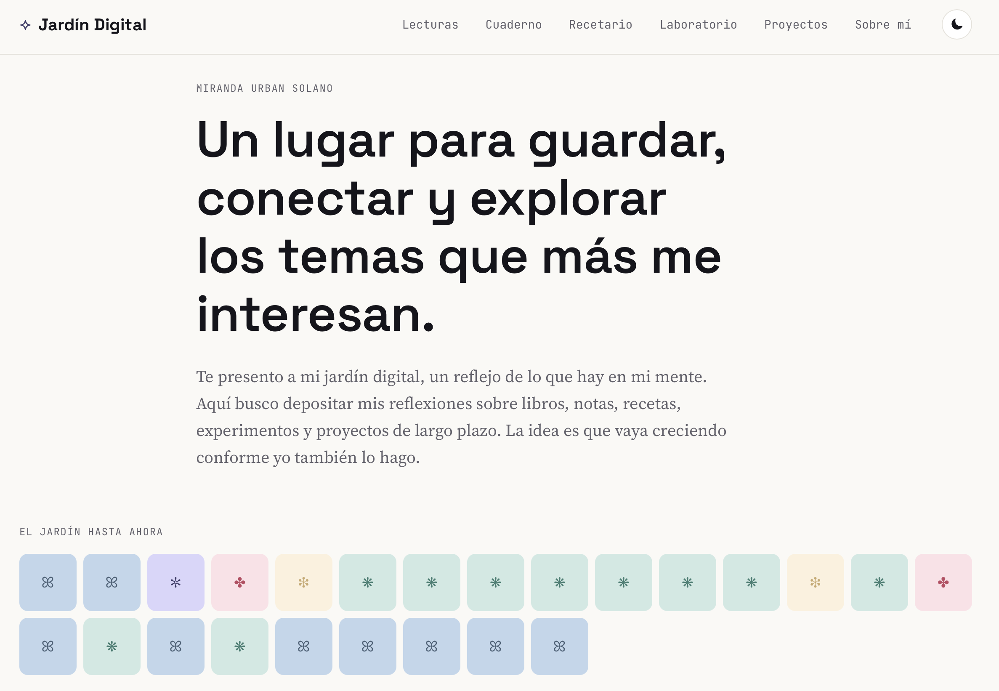

## ¿Qué me motivo a hacerlo?

La razón por la que me motivé a empezar este proyecto fue la búsqueda de orden. Tengo muchísimos intereses y trato de documentarlos lo mejor que puedo, pero están repartidos en muchísimos lugares: cuadernos, documentos, bookmarks, apps, y muchísimos borradores en las notas de mi teléfono. Vivía tratando de mantener múltiples sistemas de manera desconectada, perdiendo la noción de dónde había escrito qué cosa, y sin poder hilar verdaderamente mis ideas.

Con el fin detener este caos, comencé este proyecto con la esperanza de qué fuera una herramienta de utilidad, no sólo quería poder tener todo en un mismo lugar, sino que quería que coexistiera y evolucionará de manera integral.   

## ¿Qué es un jardín digital?

Para poder entender este proyecto, necesitamos entender la definición de un jardín digital: es un espacio para documentar y conectar ideas a través de una página web. Este sitio, en sí mismo, es un proyecto de largo plazo: no busca tener una "versión final", busca tener un sistema que pueda seguir creciendo sin que se vuelva insostenible mantenerlo.
 

 

## Proceso: cómo desarrollé la idea

### Desarrollo inicial

Lo primero que hice fue mapear exactamente lo que quería hacer. En una tarde lluviosa, me senté a describir que quería lograr con este sitio web, básicamente, hice un draft de lo que mencioné anteriormente con palabras más, palabras menos. Una vez que sabía cuál era mi objetivo, comencé a plantearme cómo iba a organizarlo: qué secciones habría, cómo se relacionarían entre ellas, básicamente la estructura del sitio web. Después entré a Pinterest para buscar un poco de inspiración en cuanto a la estética y me di cuenta que buscaba una mezcla entre lo editorial y lo cálido, un sitio web que estuviera enfocado en el contenido, pero que no descuidara la estética. Con base en estos elementos proseguía desarrollar la siguiente parte.

### Decisiones importantes

Una vez teniendo la base del proyecto, proseguí a tomar decisiones más "administrativas" como, por ejemplo:

- **Astro + Markdown**, sin base de datos. El contenido vive en archivos de texto plano, así que sobrevive aunque cambie de framework algún día.
- **Secciones específicas**. Aunque ya tenía una idea de las secciones que quería crear, aún tenía que especificarlas aún más, y es ahí donde surgieron las secciones como: Lecturas, Cuaderno, Recetario, Laboratorio y Proyectos cubren los modos en los que realmente pienso.
- **Tags libres en vez de categorías cerradas**. Prefiero que el contenido se conecte por ideas compartidas a que quede encajonado en una sola carpeta.

### Lo que dejo pendiente a propósito

Me propuse construir este sistema de la manera más básica posible, porque quería comenzar a crear contenido que fuera valioso para mí lo antes posible. Es por ello que decidí dejar pendiente tareas como: sin autenticación, sin comentarios, sin analytics. No porque nunca vayan a servir, sino porque agregarlos ahora sería resolver un problema que todavía no tengo.   

## Próximos pasos

1. Implementar un buscador simple para encontrar entradas por título, etiquetas o texto.
2. Añadir conexiones entre notas para que aparezcan backlinks o referencias relacionadas.
3. Crear un mapa o índice temático que ayude a navegar el jardín cuando crezca.
