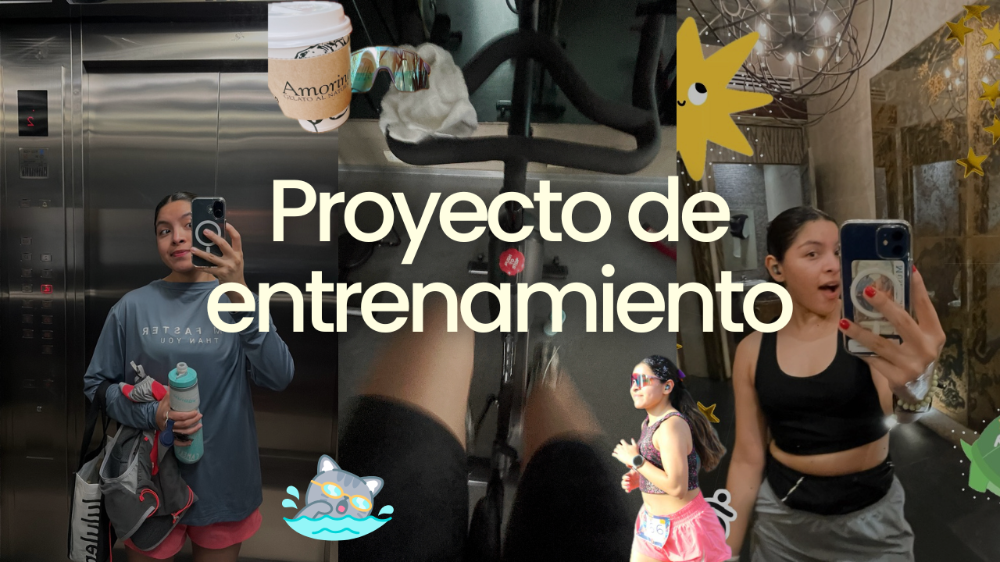

Entrenar se ha convertido en uno de los proyectos más constantes de mi vida. Más que preparar una competencia específica, me interesa construir una base física amplia y entender cómo funciona el entrenamiento cuando distintas disciplinas conviven entre sí.

Corro desde hace más de un año, entreno fuerza, hago yoga y cardio de forma consistente. Más recientemente empecé a dedicarle tiempo a la natación y al ciclismo con un enfoque más estructurado. No busco hacer más por hacer; busco entrenar con intención y comprender mejor cómo responde mi cuerpo.

## El objetivo

Desarrollar resistencia, fuerza y técnica mientras aprendo a distribuir mejor el entrenamiento entre distintas disciplinas. No persigo un resultado inmediato, sino un proceso sostenible que pueda evolucionar con el tiempo.

## El estado actual

Hoy la carrera es mi disciplina más sólida. La bicicleta me permite construir capacidad aeróbica con poco impacto, mientras que la natación sigue siendo el área donde más tengo por aprender desde el punto de vista técnico. Ese desequilibrio ha cambiado varias veces la forma en que organizo mis semanas y, probablemente, seguirá haciéndolo.

## Cómo entreno

- Entre una y dos horas de entrenamiento la mayoría de los días.
- Combinación de running, natación, ciclismo, fuerza y yoga.
- Una mezcla de sesiones de técnica, intervalos, trabajo aeróbico y fondos largos.
- Movilidad y recuperación cuando la carga lo requiere.
- Ajustes frecuentes según fatiga, progreso y disponibilidad.

## Algunos hitos

- **Enero:** inicié el año corriendo un medio maratón para conocer mi punto de partida en resistencia.
- **Febrero:** completé mis primeros 1330 metros continuos en piscina, un avance importante en control respiratorio y confianza.
- **Marzo a mayo:** aumenté el volumen total de entrenamiento y consolidé una rutina mucho más consistente.
- **Junio:** empecé a priorizar la calidad sobre la cantidad, redistribuyendo la carga entre disciplinas e incorporando los primeros entrenamientos combinados.
- **Julio:** ya puedo nadar 1600 metros con confianza. Aún me cansó, aún hay mucho por mejorar, pero tengo la confianza de entrar a la alberca y saber que podré dar mi 100% en entrenamientos más largos y con intervalos más amplios.

## En qué estoy trabajando

- Mejorar la técnica de natación.
- Construir una base aeróbica más sólida en bicicleta.
- Mantener la carrera sin acumular fatiga innecesaria.
- Desarrollar fuerza que sea útil para todas las disciplinas.
- Aprender a ajustar el entrenamiento según la recuperación y no solo según el plan.

## Sobre este proyecto

Esta página no pretende ser un diario donde registro cada entrenamiento. Prefiero mantener un documento vivo que refleje cómo cambian mis objetivos, las decisiones que tomo y lo que voy aprendiendo durante el proceso.

Es probable que con el tiempo aparezcan nuevas disciplinas, cambien las prioridades o incluso desaparezca la idea de un triatlón. Lo que no cambia es el propósito del proyecto: construir una base física sólida y seguir aprendiendo a entrenar mejor.
